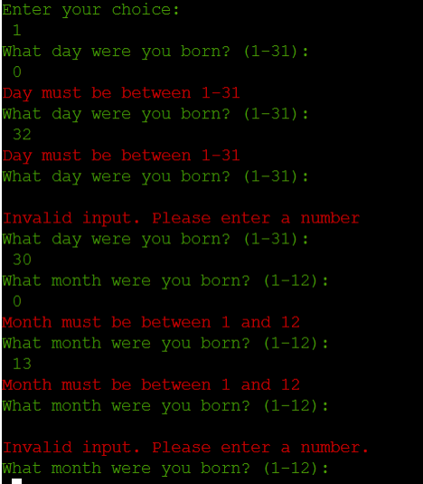
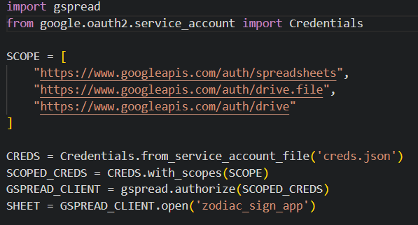

# Zodiac Sign App

Zodiac Sign App is an interactive Python terminal program, which runs in the Code Institute mock terminal on Heroku and provides a variety of information related to your zodiac sign. When you open the Zodiac Sign App, you will be greeted and asked to enter your name. The program will then prompt you to provide your birth date, and use this to determine your zodiac sign. You can also choose from several other options to see predictions for your zodiac sign, check compatibility with other signs, see your sign's description, etc.

View the live project [here](https://zodiac-sign-app-7fd49a0a9ccc.herokuapp.com/)

## User Experience

### Target Audience

* People interested in astrology and zodiac signs - Those who follow horoscopes and believe planetary positions at birth impact personality.
* Casual astrology fans - Those who may not fully believe in astrology but think zodiac signs are fun and enjoy reading horoscopes.
* Teenagers and young adults - Astrology and zodiac signs are popular among young demographics. This type of app could appeal to them.

### Key Project Goals

* Provide accurate zodiac sign information - Ensure astrological data and predictions meet quality criteria.
* Develop an engaging, interactive experience - Allow users to explore and learn about signs through a conversational interface.

### User Stories

* As a program creator, I want to:

1. Build an interactive app for the users to learn more about their zodiac signs.
2. Make the app easy to navigate.

* As a new visitor, I want to be able to:

1. Understand the purpose of the program.
2. Get feedback at all times.
3. Navigate easily through the program.

## Design Stage

### Flowchart

This flowchart illustrates the overall program logic and user experience of navigating through the various features. It demonstrates how the user can easily access each feature from the main menu, which reappears after completing each one.

### Colours
* The colours for the project were added using [Python Colorama](https://pypi.org/project/colorama/)

#### Consistency

* Instructions/Explanation

Instructions or explanation for the user have white colour throughout the program. 

Example: Instructions before username input

* Input

User input have green colour throughout the program. 

Example: Enter your name input

* Output

Every feature output have blue colour throughout the program. 

Example: Welcome message

* Menu

Menu has yellow colour throughout the program. 

Example: Menu with 5 options

* Errors

Errors have red colour throughout the program. 

Example: Invalid menu option choice

The colours compliment each other well and promote a positive emotional response in users.

### ASCII Art

This ASCII Art was created using [Text to ASCII Art Generator](https://patorjk.com/software/taag/#p=display&h=2&f=Avatar&t=Zodiac%0ASign%20APP%20). 

* Font: Big
* Character Width: Fitted
* Character Height: Fitted

## Features

### Existing Features

* __Instructions and Name Input__

  * The user is met with instructions before entering their username.
  * This feature will allow user to enter their username to start a program.
  
   

* __Welcome Message__

  * The user is greeted with the ASCII Art appearing in the terminal.
  
   

* __Menu__

  * The menu has 5 different options, each giving the user a feedback.
  * This feauture will allow the user to choose any of the given options in any order.
  
   

* __1. Choose your zodiac sign__

  * The feature has two input fields, one for birth day and one for birth month.
  * This feauture will allow the user to find out their zodiac sign and gives them a little description about it.
  
   

* __2. Choose a sign for compatibility__

  * The feature has two input fields, one for user sign and one for the sign the user wants to check compatibility with.
  * This feature will allow the user to find out how compatible or not they are with other zodiac signs.
  * There are three types of output for the user: "very compatible", "slightly compatible" or "not compatible". 
  * The percentage rate goes from 70 to 100% for high compatibility and from 50 to 69% for average compatibility.
    
   * High compatibility

   

   * Average compatibility

   

   * Zero compatibility
   
   

* __3. See predictions for your zodiac sign__

  * The feature has one input field for the user to enter their zodiac sign.
  * This feature will allow the user to see 2-3 predictions for their zodiac sign.

   

* __4. See your lucky number for today__

  * The feature has one input field for the user to enter their zodiac sign.
  * This feature will allow the user to get their random number between 1 and 25 and show them the current date.

   

* __5. Exit program__

  * This feature will allow the user to exit the program.

   

### Error Handling

1. Username input

   

   The user is required to enter their username with letters only, starting with capital letter. Entering any other values will result in an error.
2. Menu choice

   

   The user is required to enter numbers between 1 and 5 to choose an option from the menu. Entering any other values will result in an error.
3. Choose your zodiac sign (Option 1)

   

   The user is required to enter numbers between 1 and 31 for the birth day and between 1 and 12 for the birth month. Entering any other values will result in an error.
4. Choose a sign for compatibility (Option 2)

   

   The user is required to enter valid zodiac sign that starts with a capital letter. Entering any other values will result in an error.
5. See predictions for your zodiac sign (Option 3)

   

   The user is required to enter valid zodiac sign that starts with a capital letter. Entering any other values will result in an error.
6. See your lucky number for today (Option 4)

   

   The user is required to enter valid zodiac sign that starts with a capital letter. Entering any other values will result in an error.

This program offers a flexible user experience, adapting based on the user's knowledge. The user is not forced to navigate through irrelevant menu options. Instead, the flow adjusts to provide a tailored interaction:

If the user is unsure of their zodiac sign, they will be prompted to enter their birth date. The program will then determine and reveal their sign. However, if the user already knows their sign, they can simply enter it upfront to immediately receive customized feedback.

### Future Features

* Birth chart generator - Create more detailed astrological birth charts based on user input.
* Numerology calculator - Calculate numerology numbers and meanings based on birthday.
* Retrograde tracker - Track current and upcoming retrograde planets and their effects.

## Storage Data

For this project, I used Google Spreadsheet to store the data for the user. The username and user sign once entered for predictions are stored in a "zodiac-sign-app" spreadsheet. To achieve this, I used Google Drive and Google Spreadsheet API. When I was deploying my project, I added CREDS to the Config Vars. The creds.json file with a sensitive information is .gitignore to make sure that my credentials are not pushed to the repository.

### Code to connect to Google Spreadsheet

## Data Model

* The main entities are User and Zodiac Sign
* User has a name, birth day and birth month
* Zodiac Sign has name, description, compatibility rate, predictions and lucky number
* Compatibility, predictions and descriptions are stored in dictionaries
* User name and sign entered for predictions are stored in Google Spreadsheet
* Main operations:

  * Lookup user's sign
  * Get compatibility between different signs
  * Get predictions for each sign#
  * Generate lucky number
  * Save user data

## Testing

### Validator Testing

* No errors were returned from [CI Python Linter](https://pep8ci.herokuapp.com/)

   * Main python file (run)

  

   * Signs file
  

   * Descriptions file
  

   * Compatibility
  

   * Predictions file
  

### Manual Testing

I have manually tested this program in:

* VSCode terminal
* Codeanywhere terminal
* Code Institute Heroku terminal

Manual Testing results: 

