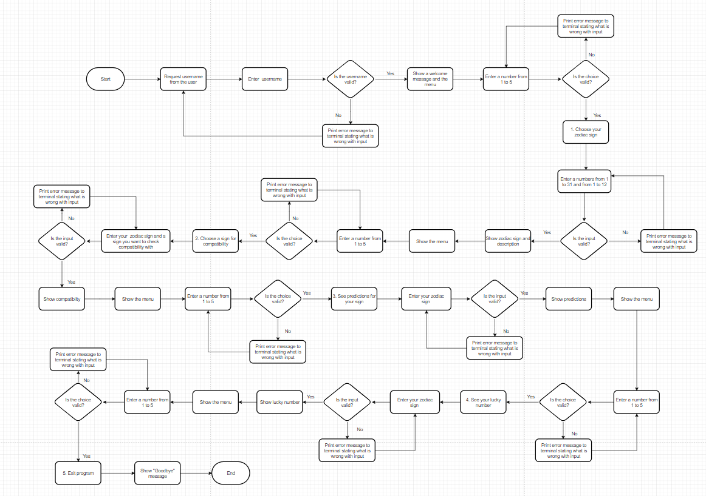

# Zodiac Sign App

Zodiac Sign App is an interactive Python terminal program, which runs in the Code Institute mock terminal on Heroku and provides a variety of information related to your zodiac sign. When you open the Zodiac Sign App, you will be greeted and asked to enter your name. The program will then prompt you to provide your birth date, and use this to determine your zodiac sign. You can also choose from several other options to see predictions for your zodiac sign, check compatibility with other signs, see your sign's description, etc.

View the live project [here](https://zodiac-sign-app-7fd49a0a9ccc.herokuapp.com/)

## User Experience

### Target Audience

* People interested in astrology and zodiac signs - Those who follow horoscopes and believe planetary positions at birth impact personality.
* Casual astrology fans - Those who may not fully believe in astrology but think zodiac signs are fun and enjoy reading horoscopes.
* Teenagers and young adults - Astrology and zodiac signs are popular among young demographics. This type of app could appeal to them.

### Key Project Goals

* Provide accurate zodiac sign information - Ensure astrological data and predictions meet quality criteria.
* Develop an engaging, interactive experience - Allow users to explore and learn about signs through a conversational interface.

### User Stories

* As a program creator, I want to:

1. Build an interactive app for the users to learn more about their zodiac signs.
2. Make the app easy to navigate.

* As a new visitor, I want to be able to:

1. Understand the purpose of the program.
2. Get feedback at all times.
3. Navigate easily through the program.

## Design Stage

### Flowchart

This flowchart illustrates the overall program logic and user experience of navigating through the various features. It demonstrates how the user can easily access each feature from the main menu, which reappears after completing each one.

### Colours
* The colours for the project were added using [Python Colorama](https://pypi.org/project/colorama/)

